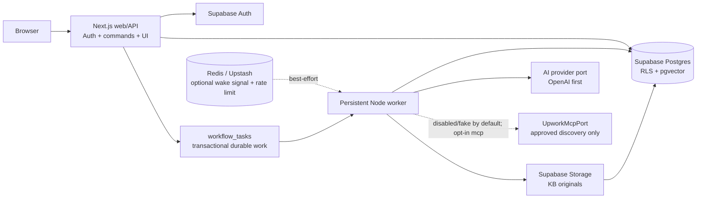
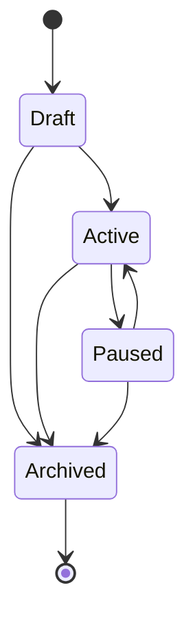
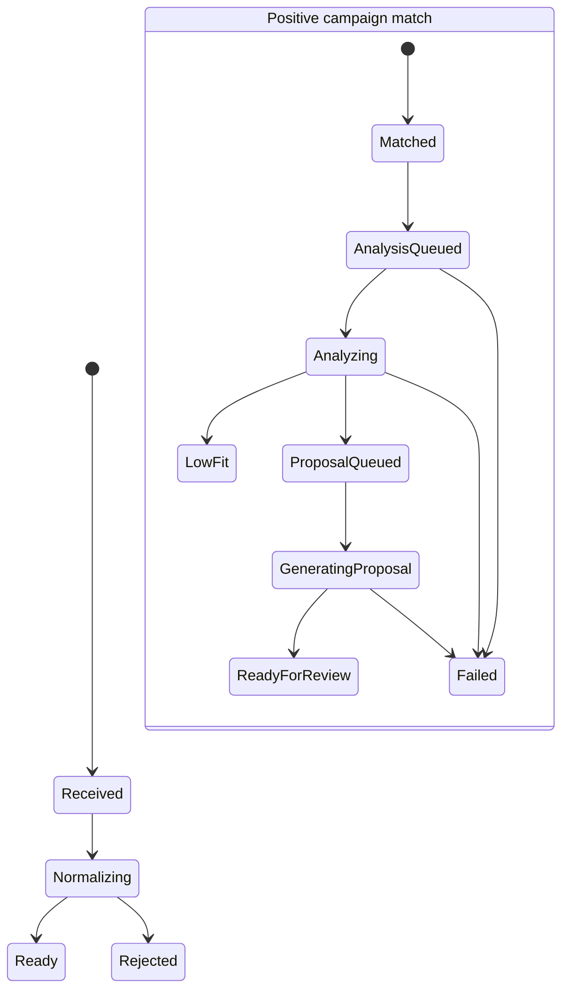

# Phase 1 Architecture

## Phase 2 amendment — approved monitor foundation

On 2026-08-15, the product owner reported written confirmation from
`mcp-support@upwork.com` for unattended recurring MCP job discovery and
internal user-preference scoring. This supersedes the earlier product-level
uncertainty for those two features, but it does not invent missing technical
limits.

The approved narrow foundation now adds:

- a worker-only `UpworkMcpPort` with a single validated `searchJobs` operation;
- one durable `poll-upwork-monitor` task whose successful transaction stores
  the next scheduled task, so a process restart does not lose the schedule;
- one connection-scoped `purge-upwork-data` schedule that runs independently
  of monitor pause state and hard-deletes MCP-derived data at 30 days;
- tenant-owned connection metadata and per-campaign monitor state;
- explicit `jobs.workspace_id` ownership plus a composite workspace/job match
  constraint;
- server-only `upwork_job_observations` provenance so an MCP job is matched only
  to the campaign monitor that discovered it;
- a deterministic, versioned preference score based on user-selected filters
  and weights, stored separately from AI suitability;
- a network-free fake adapter for local/test use.

Live Upwork traffic is opt-in. The default is `disabled` and `fake` is rejected
in production. A fixed remote transport, encrypted AES-256-GCM credential
vault, workspace/connection-bound resolver, automatic OAuth refresh, and a
user-directed OAuth PKCE/DCR connect/callback flow are implemented. The `mcp`
provider calls only the approved `upwork__find_jobs` operation, serializes
requests per connection, handles server retry guidance, and stores only
bounded, 30-day-retained output. A bounded read-only deployment smoke test is
still required before enabling real monitors. See
[UPWORK_MCP_SCOPE.md](UPWORK_MCP_SCOPE.md).

## Decision summary

This repository is a small pnpm workspace with **two deployables**: a
Next.js web/API application and a long-running Node.js worker. They share one
Postgres-backed domain layer but never invoke each other over HTTP for workflow
work. Supabase supplies Postgres, Auth, Storage, and `pgvector`; Redis remains
behind a narrow, Upstash-compatible notification/rate-limit port rather than a
second source of workflow truth.

The launch architecture deliberately optimizes for ten customers:

- one Supabase project and one Postgres database;
- one web process and one worker process, each scalable independently later;
- a PostgreSQL durable task table, not Kafka, Temporal, or an event bus;
- direct SQL-shaped schema and migrations through Drizzle;
- one runnable fake AI provider plus a server-only OpenAI Responses adapter
  behind a small interface;
- opt-in read-only Upwork MCP discovery, with no browser automation, CRM,
  inbox, dashboard product, or team-management UI in the Phase 1 checkpoint.

Checkpoint 1 now implements this boundary: strict shared domain contracts,
Drizzle repositories and a reviewed SQL migration, a Next.js web application,
and a persistent Node worker. No credential is committed. The fake AI provider
is the runnable default; the OpenAI option requires an explicit server-side
key/model configuration and parses strict structured output before persistence.

## Goals and non-goals

The first usable vertical slice is:

```text
Sign in -> create campaign -> inject development job -> normalize/deduplicate
-> deterministic match -> AI suitability -> KB retrieval -> proposal queue
```

The HTTP request that injects a job only records durable intent and returns. A
worker does the slow or retryable steps. At-least-once task delivery plus
database uniqueness constraints makes outcomes idempotent; an LLM network call
may be repeated after a process crash, but it must never create duplicate
scores, proposals, or applications.

Out of scope for the Phase 1 baseline (with the narrow monitor amendment above):

- a live remote Upwork adapter until its exact operational contract is recorded;
- any Upwork application submission or Playwright browser worker;
- CRM, unified inbox, email automation, advanced analytics, and a data
  warehouse;
- invitations, multi-account orchestration, billing, feature flags, and
  multi-region deployment;
- Kubernetes, a message broker, event sourcing, and generic agent/tool-calling
  infrastructure.

## Logical architecture



The dotted Redis path is intentionally non-critical. The database task row is
created in the same transaction as the state change that requires work. The
worker polls the database and can recover all work after a Redis outage or a
missed notification. This avoids coordinating two durable systems and avoids
idle queue traffic becoming a meaningful cost at a ten-customer launch.

### Deployable boundaries

| Deployable | Responsibility | Must not do |
| --- | --- | --- |
| `apps/web` | UI, Supabase session handling, authorization, validation, synchronous CRUD commands, writing durable task intent, and user-directed Upwork OAuth consent/callback exchanges | Call OpenAI, invoke Upwork discovery tools, run a browser, wait for background pipeline completion, or process tasks in-process |
| `apps/worker` | Claim/retry tasks, run durable Upwork monitor polls, normalize jobs, match campaigns, call AI, index KB documents, and produce proposal versions | Serve public HTTP, invoke unapproved Upwork tools, or trust a user-supplied workspace ID without a stored task/context |
| Supabase | Auth, Postgres, `pgvector`, object storage, backups, and row-level safety policies | Execute business workflows or browser automation |
| Redis/Upstash adapter | Best-effort worker wakeups and later distributed rate limits/caching | Be the durable queue or source of workflow state |

The web and worker have independently buildable Docker targets in
`deploy/web.Dockerfile` and `deploy/worker.Dockerfile`, with Railway service
templates in `deploy/railway-web.json` and `deploy/railway-worker.json`. The
recommended first deployment is one web service plus one persistent worker on
Railway, with Supabase Postgres/Auth/Storage in the same region. The two
processes remain independently scalable without changing domain code.

## Proposed repository topology

This is the target tree for implementation, not a request to scaffold all of
it now. A pnpm workspace is enough; do not add Turborepo, Nx, or a separate
repository.

```text
.
├── AGENTS.md
├── .env.example
├── docs/
│   ├── ARCHITECTURE.md
│   └── PHASE_1.md
├── apps/
│   ├── web/                         # Next.js App Router application
│   │   ├── app/
│   │   ├── src/server/
│   │   │   ├── auth/
│   │   │   ├── commands/
│   │   │   └── queries/
│   │   └── src/components/
│   └── worker/                      # Long-running Node process; no HTTP server
│       └── src/
│           ├── handlers/
│           ├── runtime/
│           └── adapters/
├── packages/
│   ├── core/                        # Zod schemas, pure filters, state transitions, ports
│   │   └── src/
│   │       ├── ai/
│   │       ├── campaign/
│   │       ├── jobs/
│   │       └── workflow/
│   └── db/                          # Drizzle schema, SQL migrations, repositories
│       ├── src/
│       └── drizzle/
├── supabase/
│   ├── migrations/                  # RLS, extensions, storage policies when implemented
│   └── seed.sql                     # Local-only test seed, never production data
├── tests/
│   ├── integration/
│   └── e2e/
├── docker-compose.yml               # Redis only; Supabase CLI owns local Supabase
├── pnpm-workspace.yaml
└── package.json
```

`packages/core` is intentionally a single package. It is the shared boundary
between web and worker; split it only when a real dependency/cycle appears.
`packages/db` owns table definitions and migrations. No UI component or route
should reach directly into a worker adapter.

## Major technical decisions

### Stack mapping

| Requirement | Phase 1 use |
| --- | --- |
| Next.js + TypeScript | One strict-TypeScript App Router web application, with route handlers/server commands only for short authenticated work. |
| Tailwind CSS + shadcn/ui | The web UI uses Tailwind and shadcn/ui primitives; domain/workflow logic stays outside components. |
| Supabase + PostgreSQL | Auth, Postgres, RLS, Storage, and managed backups in one low-operations service. |
| pgvector | Installed in Supabase and reserved for the additive embedding-backed retrieval upgrade; Phase 1 currently uses bounded lexical retrieval. |
| Redis/Upstash compatibility | Optional standard Redis-protocol wakeup/rate-limit adapter, not durability. |
| Zod | Runtime validation for every HTTP, task, environment, and AI boundary. |
| Drizzle | PostgreSQL-oriented schema, migrations, and typed queries. |
| Vitest + Playwright | Unit/integration tests plus deterministic end-to-end workflow coverage. |
| Docker | Local backing services and later build verification for separately deployable web/worker images. |

### Drizzle rather than Prisma

Use **Drizzle** for schema definitions, SQL migrations, and typed query access.
It is a better fit here because Phase 1 is PostgreSQL-specific: `pgvector`,
partial unique indexes, JSONB filter evidence, row leasing with `FOR UPDATE
SKIP LOCKED`, and RLS policies should remain visible as SQL. It also avoids a
large generated-client/runtime layer shared by two small deployables.

Drizzle does not replace SQL. Extensions, RLS, vector operators, partial
indexes, and task-claim queries should live in reviewed SQL migrations or
small, explicit repository functions.

### Authentication and tenancy

**Decision: Google OAuth is the only launch sign-in method.** Use Supabase's
server-side-rendered OAuth/PKCE flow with a Google sign-in button and an app
callback route. Request identity scopes only (`openid`, `email`, `profile`);
do not request Google Drive/Gmail access and do not retain Google provider
tokens. This is authentication for this product, not a Google integration.

Create the Google Web OAuth client and configure its allowed origin/redirect
URLs in Google Cloud; configure its client ID and secret in the Supabase Google
provider. Local Supabase configuration reads the secret from the local
environment, while production configuration lives in Supabase/deployment
secret settings—not in Next.js source or public variables. Supabase documents
the required Google callback and PKCE setup in its [Google OAuth guide](https://supabase.com/docs/guides/auth/social-login/auth-google).

Supabase Auth's `auth.users` is the canonical **User** entity. Do not duplicate
it in a public `users` table on day one. Add an `app_users` profile only when
there is an actual application-owned user field to persist.

Each new user receives one `workspace` with `owner_user_id = auth.users.id`.
There is no invitation or `workspace_members` table in this launch scope.
Every tenant-owned table carries `workspace_id`, and server-side commands first
verify that the authenticated user owns that workspace.

The browser uses Supabase only for authentication/session cookies. Product
tables are queried through Next.js server code; raw job payloads and worker
tables are never browser-readable. Enable RLS policies as a database safety
boundary, but do not rely on a privileged server connection to make an
unauthorized query safe. The worker uses server-only credentials and has no
user session.

### Durable task execution, not a request-time queue

`workflow_tasks` is a small infrastructure table. A command transaction writes
the domain change and its task atomically. A persistent worker claims available
rows with `FOR UPDATE SKIP LOCKED`, leases them, and renews/reclaims leases.

```text
queued -> running -> succeeded
  |         +-> retry_wait -> queued
  |         +-> dead
  +-> cancelled
```

The worker periodically finds expired leases and moves them back to
`retry_wait`. A task has a capped retry count with exponential backoff and a
sanitized error code. `dead` is visible to an operator and can be explicitly
retried. No scheduler, queue dashboard, or autonomous recovery service is
needed initially: the one worker process performs a small lease-reaper pass.

The Redis abstraction is only:

```ts
interface WorkSignal {
  notifyWorkAvailable(): Promise<void>;
}
```

Its initial implementations are `NoopWorkSignal` and a standard Redis protocol
adapter (`redis://`/`rediss://`, compatible with an Upstash TCP endpoint). A
failed notification is logged and ignored because polling remains correct. A
future BullMQ or managed queue implementation can sit behind this port if
volume warrants it; it is not justified before that point.

### AI provider boundary

The core layer owns separate generation and embedding ports. This lets a future
Claude/Gemini generation adapter be introduced without pretending that it must
also provide the same embeddings as OpenAI:

```ts
interface TextGenerationProvider {
  assessSuitability(input: SuitabilityInput): Promise<SuitabilityResult>;
  generateProposal(input: ProposalInput): Promise<ProposalDraft>;
}

interface EmbeddingProvider {
  embed(input: EmbeddingInput): Promise<EmbeddingResult>;
}
```

The worker provides an offline deterministic fake adapter for local and test
use. `AI_PROVIDER=openai` selects the server-only Responses API adapter and
requires a key/model at startup. Every response is parsed with Zod before it changes domain state. Store
provider, model, prompt version, contract version in the input hash, and a
stable provider request key with the immutable result. Do not build a model router,
prompt-management product, or provider registry before a second provider is
actually needed.

### Retrieval and knowledge base

Original user documents belong in a private Supabase Storage bucket.
`knowledge_documents` stores metadata and a content hash; extracted chunks are
workspace-scoped and indexed by a durable worker task. If an embedding model is
configured, the worker stores validated `vector(1536)` values with model
metadata in the same transaction. Deterministic token-overlap retrieval remains
the offline-safe fallback; a cosine-distance query can be enabled behind the
same seam without changing proposal contracts. Defer HNSW/IVFFlat indexing
until chunk counts and latency demonstrate a need.

`pgvector` is built into Supabase's Postgres offering, so there is no separate
vector database or synchronization path to operate.

## Data model

All IDs are UUIDs generated in Postgres. Unless noted, tables include
`created_at timestamptz not null default now()` and `updated_at timestamptz not
null default now()`. Domain data is archived/statused rather than broadly
soft-deleted. All monetary amounts use `numeric`, never floating point.

Campaigns also have an explicit, user-confirmed permanent-delete action. It
verifies workspace ownership, removes campaign-scoped monitors, matches,
scores, proposals, and pending campaign workflow tasks through the existing
cascade/cleanup paths, and retains workspace jobs because a job can be shared
by more than one campaign. Archive remains the reversible lifecycle action.

### Product entities

| Entity / table | Essential fields | Invariants and notes |
| --- | --- | --- |
| **User** / `auth.users` | Supabase-owned `id`, email, auth metadata | Canonical identity; no duplicate profile table yet. |
| **Workspace** / `workspaces` | `id`, `owner_user_id`, `name`, `created_at` | One owner and one workspace per user in UI. `unique(owner_user_id)` initially prevents accidental multi-workspace complexity. Remove deliberately when teams are approved. |
| **Campaign** / `campaigns` | `workspace_id`, `name`, `status`, `filters jsonb`, `ai_instructions`, `score_threshold smallint`, `config_version int` | `status` is `draft`, `active`, `paused`, or `archived`; threshold has `CHECK (score_threshold between 0 and 100)` and defaults to `75`. Filters are Zod-validated JSONB, not a collection of premature filter tables. |
| **Job** / `jobs` | `id`, `workspace_id`, `source`, `source_job_id`, `canonical_url`, nullable `posted_at`, `raw_payload jsonb`, normalized title/description/skills/budget/client fields, `source_payload_hash`, `normalized_hash`, `revision`, `last_matched_revision`, `status` | Tenant-owned source record. `unique(source, source_job_id)` is the primary dedupe key. Raw source data is server-only and bounded. A changed normalized hash increments `revision`; identical input is a no-op. `posted_at` is preserved only when the provider supplies it. |
| **UpworkJobObservation** / `upwork_job_observations` | `(workspace_id, monitor_id, job_id)`, `first_seen_at`, `last_seen_at` | Server-only provenance linking a de-duplicated MCP job to the exact monitor that found it. Matching joins through this table, so active campaigns cannot inherit another monitor's discovery. Cascades with the monitor or retained job. |
| **CampaignJobMatch** / `campaign_job_matches` | `workspace_id`, `campaign_id`, `job_id`, `campaign_config_version`, `job_revision`, `filter_snapshot jsonb`, `deterministic_evidence jsonb`, `pipeline_status`, `failed_step`, `failure_code` | Store only positive deterministic matches. `unique(campaign_id, job_id)` in Phase 1. The snapshot makes an in-flight result auditable even when a campaign is edited later. |
| **AIScore** / `ai_scores` | `workspace_id`, `match_id`, `input_hash`, provider/model/prompt metadata, `score`, `recommendation`, `reasons jsonb`, `risks jsonb`, `estimated_win_probability`, `pricing_direction`, suggested amount/currency | Immutable successful structured result. `unique(match_id, input_hash)`. Scores are validated against Zod before insertion; the task and match own progress/error state. |
| **KnowledgeDocument** / `knowledge_documents` | `workspace_id`, `title`, `storage_path`, `content_hash`, `status`, `failure_code` | A private-storage object is referenced rather than duplicated. Status is `uploaded`, `indexing`, `ready`, `failed`, or `archived`. |
| **KnowledgeChunk** / `knowledge_chunks` | `workspace_id`, `document_id`, `ordinal`, `content`, `content_hash`, nullable `embedding`, nullable `embedding_model` | Immutable after indexing. `unique(document_id, ordinal)`; document and workspace must agree. Embedding and model metadata are nullable so fake/offline mode remains key-free. |
| **Proposal** / `proposals` | `workspace_id`, `match_id`, `review_status`, `current_version_number`, review actor/timestamps | One aggregate per match: `unique(match_id)`. Review is `pending`, `approved`, or `rejected`; generation progress stays on the match. |
| **ProposalVersion** / `proposal_versions` | `workspace_id`, `proposal_id`, `version_number`, immutable `body`, `input_hash`, `ai_score_id`, retrieval snapshot, provider/model/prompt metadata | `unique(proposal_id, version_number)` and `unique(proposal_id, input_hash)`. Regeneration appends a version, never mutates a reviewed version. |
| **Application** / `applications` | `workspace_id`, `match_id`, `proposal_version_id`, `status`, `submission_key`, external reference/timestamps | Designed now but migration/implementation is deferred until an approved Upwork API scope exists. It must reference an immutable proposal version. |
| **AnalyticsEvent** / `analytics_events` | `workspace_id`, `actor_user_id nullable`, `event_name`, `subject_type`, `subject_id`, `properties jsonb`, `occurred_at`, `dedupe_key nullable` | Append-only instrumentation and audit context, never workflow truth. A partial unique index protects a supplied dedupe key. |

### Required infrastructure table

`workflow_tasks` is not an additional product feature. It makes the requested
asynchronous, retryable design possible without another durable service.

| Field | Purpose |
| --- | --- |
| `id`, `kind`, `schema_version`, `payload jsonb` | Typed work intent; each handler validates payload with Zod. |
| `dedupe_key` | Semantic idempotency key, for example `score:{matchId}:{inputHash}`. `unique(kind, dedupe_key)` ensures retries update/reclaim the same logical work. |
| `status`, `priority`, `run_at` | Scheduling and retry state. |
| `attempt_count`, `max_attempts`, `locked_by`, `locked_at`, `lease_expires_at` | Safe multi-worker leasing and crash recovery. |
| `last_error_code`, `last_error_message` | Sanitized diagnostic data only; no provider credentials or raw prompt dumps. |

### Initial enum/state definitions

```text
campaign.status
  draft | active | paused | archived

job.status
  received | normalizing | ready | rejected

campaign_job_match.pipeline_status
  matched | analysis_queued | analyzing | low_fit |
  qualified | proposal_queued | generating_proposal | ready_for_review |
  failed | dismissed | expired

proposal.review_status
  pending | approved | rejected

knowledge_document.status
  uploaded | indexing | ready | failed | archived

workflow_task.status
  queued | running | retry_wait | succeeded | dead | cancelled

application.status (reserved for later)
  queued | preparing | submitting | submitted | verified |
  needs_review | retry_wait | failed | cancelled
```

### Key indexes and constraints

- `jobs (source, source_job_id)` unique; `jobs (last_seen_at desc)` for recent
  ingestion inspection.
- `upwork_job_observations (workspace_id, job_id, last_seen_at desc)` and
  `(workspace_id, monitor_id, last_seen_at desc)` support provenance and
  retention work.
- `campaigns (workspace_id, status)` plus a partial active-campaign index.
- `campaign_job_matches (campaign_id, job_id)` unique; `(workspace_id,
  pipeline_status, created_at desc)` powers the queue view.
- `ai_scores (match_id, created_at desc)` and the unique input-hash key.
- `proposals (workspace_id, review_status, updated_at desc)`.
- `knowledge_chunks (document_id, ordinal)` unique. Do not add a vector index
  until there is evidence that exact search is insufficient.
- `analytics_events (workspace_id, occurred_at desc)`.
- a partial task-claim index on `(priority desc, run_at, created_at)` for
  `queued`/`retry_wait` rows and a lease-expiry index for `running` rows.

Defer filter GIN indexes, full-text search, table partitioning, and vector
HNSW/IVFFlat indexes. They are not credible launch bottlenecks.

### Migration staging

1. Enable `pgcrypto` and `vector`; create workspaces, campaigns, jobs, matches,
   scores, proposals/versions, analytics events, tasks, RLS policies, and
   relevant indexes.
2. Add the private Storage bucket only when document uploads move beyond the
   current bounded text form. Knowledge tables are created by
   `202608180005_phase1_proposals.sql`; optional embeddings are added by
   `202608210001_knowledge_embeddings.sql`.
3. Add the `applications` table only when the explicit application-worker
   milestone is approved. Its design is documented now to avoid a bad
   proposal-version relationship later; its unused table is not needed now.

## Workflow design

### Campaign lifecycle



Activating validates the current filter shape, AI instructions, and threshold.
Editing a campaign increments `config_version`. In Phase 1, edits affect only
new ingests; do not automatically rematch historic jobs. Each created match
retains the filter/instruction snapshot it was evaluated with.

### Job and match pipeline



The deterministic matcher creates no rows for campaign/job pairs that fail
filters. It returns a boolean and structured evidence such as matching skills,
budget match, and excluded keywords. This keeps the table small and makes the
filter path transparent.

### Task choreography

```text
POST development job
  transaction: upsert source identity + queue normalize-job
    -> normalize-job: normalize/dedupe, then queue match-job
      -> match-job: test active campaigns, create positive matches,
         then queue analyze-match for each
        -> analyze-match: call provider, validate/store AI score
           score below threshold: LOW_FIT
           score at/above threshold: queue generate-proposal
             -> generate-proposal: retrieve ready workspace KB chunks,
                validate/store immutable proposal version, READY_FOR_REVIEW
```

Every handler validates its task payload and rechecks prerequisite state in a
transaction. Work order is never assumed. `normalize-job` and `match-job` have
no AI dependencies; `analyze-match` sends only the necessary normalized job and
campaign snapshot; `generate-proposal` reads only `ready` documents belonging
to the match workspace.

### Idempotency boundaries

| Operation | Idempotency mechanism |
| --- | --- |
| Job ingestion | `unique(source, source_job_id)` plus payload/normalized hashes. An unchanged duplicate is a no-op. |
| Matching | `unique(campaign_id, job_id)` plus `insert … on conflict`. Only the saved campaign snapshot advances. |
| AI suitability | Stable input hash includes job revision, campaign snapshot, prompt version, and model contract. `unique(match_id, input_hash)` means one stored result wins. |
| KB indexing | Document content hash plus `unique(document_id, ordinal)` chunks. Create chunks, then atomically mark the document ready. |
| Proposal generation | `unique(proposal_id, input_hash)` and sequential `version_number`; a user regeneration has its own request/generation key. |
| HTTP mutations | First-party UI commands include a request identifier where double-submit matters. A generic idempotency table is deferred until there is a public API. |

Exactly-once delivery across Postgres and an external AI API is not possible.
When a process crashes after a provider response but before the DB commit, a
retry may make a second provider call. Persist a stable provider request key
where supported, make the DB write conditional, and make duplicate spend
observable; never promise an impossible exactly-once external call.

### Approved discovery and future application workflow

Proposal approval in Phase 1 is a manual review decision only; it must not
create an Application or submit anything.

The product owner reports written support approval for recurring MCP discovery
and internal scoring. The code therefore implements the durable discovery seam,
fixed live adapter, and fake-backed vertical slice. Support subsequently identified
`upwork__find_jobs`, the hosted MCP endpoint, OAuth 2.1 dynamic registration,
the standard rate ceiling, and a 30-day retention limit. The authenticated
schema and one bounded response are now captured. Production activation still
requires applying the migrations and completing one bounded read-only smoke
test as documented in
[UPWORK_MCP_SCOPE.md](UPWORK_MCP_SCOPE.md). Upwork's
[MCP overview](https://www.upwork.com/ai/mcp) and
[API/MCP terms](https://www.upwork.com/legal#apimcpterms) remain the external
contracts; a browser login is never used as a substitute.

Do not use Playwright, browser cookies, a browser extension, page scraping,
auto-refresh, or website endpoints as a workaround. The only external seam is
the narrow worker port.

If an approved API later permits a submission workflow, it must be a separate
deployable adapter that consumes an immutable approved proposal version; it
will never be launched from a Next.js route handler. If approval does not
permit it, the safe product behavior is a manual handoff (copy/open the
proposal for the user), not simulated browser submission.

## Application interfaces

### Deterministic filters

Campaign filters remain one versioned JSONB document, validated on every write
with a shared `CampaignFilterV1` Zod schema. The initial contract incorporates
the supplied Upwork-style search controls, including an optional client
hire-rate percentage range, while staying one document rather than a
collection of filter tables.

| Filter group | Stored rule | Normalized job data required |
| --- | --- | --- |
| Skills and text | Include/exclude skills plus title/description keywords | `skills`, `title`, `description` |
| Category | One or more canonical source category IDs | `category_ids` |
| Experience level | One or more of `entry`, `intermediate`, `expert` | `experience_level` |
| Job type | `hourly`, `fixed`, or both | `job_type` |
| Hourly rate | One inclusive USD minimum/maximum | `hourly_rate_min`, `hourly_rate_max` |
| Fixed-price budget | One inclusive USD minimum/maximum; preset choices set the same range | `fixed_budget_min`, `fixed_budget_max` |
| Number of proposals | One inclusive count range, with presets such as `<5`, `5–10`, `10–15`, `15–20`, `20–50` | `proposal_count` |
| Payment verified | `any`, `only_verified`, or `only_unverified` | `payment_verified` |
| Client history | A selected hires range: `0`, `1–9`, or `10+` | `client_hire_count` |
| Client hire rate | Inclusive percentage range from `0` to `100` | `client_hire_rate_percent` |
| Client location | One or more ISO country codes | `client_country_code` |
| Client time zone | One or more IANA time-zone IDs | `client_time_zone` |
| Project length | One or more duration bands: `<1m`, `1–3m`, `3–6m`, `>6m` | `project_length_band` |
| Hours per week | One or both bands: `<30`, `30+` | `hours_per_week_band` |
| Contract-to-hire | `any`, `only`, or `exclude` | `is_contract_to_hire` |

The fixed-price presets map to a normal range (`< $100`, `$100–500`,
`$500–1K`, `$1K–5K`, `$5K+`); custom values override the preset. A campaign
uses one contiguous rate/budget/proposal-count range at launch. This avoids a
rare and confusing case such as simultaneously seeking jobs below $100 and
above $5K. The UI can expose multi-select only where it is useful: categories,
experience levels, job types, locations, time zones, and duration/hour bands.

Rules combine with **AND** across filter groups and **OR** within a selected
multi-value group. An omitted group imposes no constraint. If a selected rule's
source value is missing on a job, the job does not match by default and the
evidence records `missing_source_data`; silently treating missing data as a
match would defeat deterministic filtering.

`My previous clients` is deliberately not active in Phase 1. It requires a
trusted client-identity history for each user, which the development job source
does not have and real Upwork access may not provide in an approved scope. An
inert filter would be misleading, so omit/disable it until that source exists.
The availability counts shown beside search options are also not campaign
configuration—they are live search-result estimates and cannot exist before an
approved discovery source is available.

The pure matcher returns `{ matched, evidence }`; it has no database, clock,
randomness, or AI dependency and receives a normalized job, the saved campaign
snapshot, and (for publication-age rules) an explicit caller-supplied timestamp.
Development-job injection supports these fields directly.
When a future approved source is added, it must map source fields to this
normalized contract and document every unavailable field before the filter is
enabled for that source.

### Transparent preference scoring

Jobs that pass the deterministic hard filter receive a separate preference
score from `0` to `100`. It is pure and reproducible: the score uses only the
saved campaign filter, user-selected weights, normalized job, and deterministic
evidence. Six bounded dimensions are supported: skills, keywords, budget,
competition, client quality, and project fit. The stored result includes each
component's weight, score, and explanation.

This value is not the AI suitability score and is never represented as an
Upwork ranking. Changing weights increments campaign configuration for future
jobs; existing stored results keep their original evidence.

### Structured suitability result

The OpenAI adapter must produce a Zod-validated object equivalent to:

```ts
{
  score: number; // integer 0..100
  recommendation: "apply" | "review" | "skip";
  reasons: string[];
  risks: string[];
  estimatedWinProbability: number; // 0..1
  pricingDirection: "below_market" | "market" | "premium" | "hourly";
  suggestedBidAmount?: number;
  suggestedBidCurrency?: string;
}
```

The domain service rejects a malformed model result, rather than storing
unvalidated JSON or guessing missing fields.

## Local development requirements

To run the implementation locally, developers need:

- current Node.js LTS (Node 22 or newer) and pnpm;
- Docker Desktop for local Supabase services and a standalone local Redis;
- Supabase CLI for local Auth, Postgres, Storage, migrations, and RLS testing;
- a local `.env` copied from `.env.example`; no shared keys committed anywhere.

Expected local runtime shape:

```text
Supabase CLI (`supabase start`) -> local Auth + Postgres + Storage
Docker Compose (`redis`)        -> local Redis compatible endpoint
pnpm dev:web                    -> Next.js
pnpm dev:worker                 -> persistent worker
```

The web and worker run natively for fast reload. Docker is useful for the
backing services and later for validating the two production images, not for
making every local edit slow. Integration tests use a dedicated local database
schema; Playwright starts the web and worker with `AI_PROVIDER=fake`, so neither
tests nor CI require an OpenAI credential.

## Environment variables

All names are defined in `.env.example`; example values are non-secret
placeholders only. `NEXT_PUBLIC_` variables are intentionally limited to
publishable Supabase connection settings.

| Variable | Used by | Required when | Purpose |
| --- | --- | --- | --- |
| `APP_URL` | web | always | Canonical local/deployed application URL. |
| `NEXT_PUBLIC_SUPABASE_URL` | web/browser | auth | Supabase project URL; publishable. |
| `NEXT_PUBLIC_SUPABASE_ANON_KEY` | web/browser | auth | Publishable Supabase anon key. |
| `SUPABASE_URL` | worker/server | server SDK use | Server-side Supabase project URL; same value as the publishable URL without a browser contract. |
| `SUPABASE_AUTH_EXTERNAL_GOOGLE_CLIENT_ID` | local Supabase only | local Google OAuth | Google OAuth client ID; configure the production equivalent in Supabase, not in the web app. |
| `SUPABASE_AUTH_EXTERNAL_GOOGLE_CLIENT_SECRET` | local Supabase only | local Google OAuth | Server-only Google OAuth secret used by local Supabase. |
| `DATABASE_URL` | web/worker | app runtime | Pooled application database connection. Never browser-exposed. |
| `DIRECT_DATABASE_URL` | migrations/worker | migrations and long-lived workers | Direct Postgres connection, kept separate from a pooler URL. |
| `TEST_DATABASE_URL` | database tests | local integration checks | Dedicated local Postgres URL; tests skip rather than touch an unknown database when absent. |
| `SUPABASE_SERVICE_ROLE_KEY` | local E2E/admin setup | Storage/admin operations or local test-user bootstrap | Optional server-only Supabase credential; the current production runtime does not require it. Never in Next public configuration. |
| `SUPABASE_STORAGE_BUCKET` | worker | KB phase | Name of the private KB bucket. |
| `REDIS_ENABLED` | worker | optional adapter enabled | Explicitly enables the Redis signal/rate-limit adapter; false keeps the launch on Postgres polling alone. |
| `REDIS_URL` | worker | Redis signal/rate-limit adapter enabled | Standard `redis://` or TLS `rediss://` endpoint; optional in Phase 1a. |
| `AI_PROVIDER` | worker/tests | AI phase | `fake` locally/tests; `openai` only after secure configuration. |
| `OPENAI_API_KEY` | worker | OpenAI adapter enabled | Server-only secret; required only when `AI_PROVIDER=openai`. |
| `OPENAI_TEXT_MODEL` | worker | OpenAI adapter enabled | Structured-output model identifier; required only when `AI_PROVIDER=openai`. |
| `OPENAI_EMBEDDING_MODEL` | worker | optional KB embeddings | Embedding model identifier; when blank, indexing remains deterministic and lexical. |
| `UPWORK_MONITOR_PROVIDER` | web/worker | monitor enabled | `disabled` by default; `fake` is local/test only and rejected in production; `mcp` opts into the fixed read-only connector. |
| `UPWORK_MCP_MIN_POLL_INTERVAL_SECONDS` | web/worker | monitor enabled | Enforces the conservative lower cadence bound. The five-minute launch default is intentionally far below the quoted standard API ceiling; server retry guidance always wins. |
| `UPWORK_MCP_CREDENTIAL_ENCRYPTION_KEY` | web/worker server only | encrypted OAuth material | Base64-encoded, exactly 32 random bytes used for AES-256-GCM. Store solely in the deployment secret manager; never in `NEXT_PUBLIC_*`, source control, logs, or a user-facing form. |
| `UPWORK_MCP_OAUTH_REDIRECT_URL` | server only | Upwork OAuth callback | Final stable public HTTPS callback, for example `https://app.example.com/api/upwork/oauth/callback`. It must be an exact match during dynamic client registration. |
| `UPWORK_MCP_APPROVAL_REFERENCE` | web/server | monitor enabled | Non-secret reference to retained approval evidence; never contains the email body or a credential. |
| `DEV_INGESTION_ENABLED` | web | local/dev only | Explicit gate for the internal development-job endpoint; false in production. |
| `DEV_INGEST_TOKEN` | web | local/dev endpoint enabled | Server-only token in addition to authenticated ownership checks. |
| `RUN_E2E`, `E2E_BASE_URL` | Playwright | browser scenario enabled | Explicitly runs the local full-flow scenario and optionally overrides its loopback app URL. |
| `E2E_AUTH_ENABLED`, `E2E_AUTH_TOKEN`, `E2E_AUTH_EMAIL`, `E2E_USER_PASSWORD` | local web/tests | browser scenario enabled | Double-gated local test identity; the route is rejected in production and setup refuses remote Supabase. |
| `WORKER_ID` | worker | always | Stable logical identity for leases/logs. |
| `WORKER_CONCURRENCY` | worker | always | Start at `1`; raise only after measurements. |
| `WORKER_HEALTH_PORT` | worker | hosted health checks | `0` disables the local listener; hosted Railway uses `8080` and probes `/health`. |
| `WORKER_POLL_INTERVAL_MS` | worker | always | Recovery polling cadence. |
| `LOG_LEVEL` | web/worker | always | Structured log verbosity. |

## Launch hosting and region recommendation

**Default recommendation: Railway Hobby for the web and worker, deployed in
Southeast Asia, with Supabase in Southeast Asia (Singapore).** This is the best
balance of reliability, low operational burden, and predictable early cost for
the initial ten-customer launch:

- Railway treats each deployable as a service/container, so the web and worker
  remain separate without building infrastructure. Its Hobby plan has a $5
  minimum with $5 of included monthly usage, health checks/restart controls,
  and a 99.9% availability target; its pricing remains usage-based after that.
- Railway's only APAC deployment region is Southeast Asia, and Supabase offers
  Singapore as its APAC location. Keeping web, worker, database, and storage in
  that region avoids needless cross-region database traffic.
- Do not use the free plan for a customer-facing deployment. It has deployment
  restrictions during regional peak hours; paid Hobby avoids that restriction.

Fly is a good alternative, not the default: its raw always-on machine cost can
be lower and it offers a Mumbai region, matching Supabase's Mumbai region. Use
**Fly Mumbai + Supabase Mumbai** only if India is the clear primary customer
location or India-specific data locality/latency matters enough to justify the
extra deployment/operations surface. A single web process and a single worker
are not high availability on either host; data durability comes from managed
Supabase. Add multi-region replicas only when the customer/revenue need
justifies their recurring cost.

The cost comparison must stay directional until the actual CPU/RAM limits are
set. Railway charges per CPU, memory, and egress after included usage; Fly
charges provisioned machine resources by the second and varies by region. The
AI API and Supabase plan can become larger cost drivers than this tiny compute
pair. Sources: [Railway pricing](https://railway.com/pricing), [Railway
regions](https://docs.railway.com/networking/edge-networking), [Fly
pricing](https://fly.io/docs/about/pricing/), and [Supabase
regions](https://supabase.com/docs/guides/platform/regions).

## Cost and evolution plan

Start with managed Supabase, a single web service, and a single worker. Redis
may be omitted in local/production Phase 1a because the task table is durable;
add a small Upstash-compatible endpoint only when wakeup latency or distributed
rate limits make it useful. This is an intentional cost control, not a missing
reliability component.

Minimize AI cost by scoring only deterministic matches, setting strict input
and output token budgets, storing input hashes, and retrieving KB chunks only
for scores above the campaign threshold. Store current business artifacts, not
unbounded raw provider traces. Use structured logs and `analytics_events` for
operation visibility before buying observability or analytics products.

The seams that should remain stable as usage grows are: the worker deployable,
task handler contract, AI provider contract, and SQL schema/migrations. Redis
can graduate to a stronger queue, the worker can scale horizontally, and search
can add an HNSW vector index without changing the campaign/proposal APIs.

## Simplification review

This review was performed after the initial design specifically to keep a
ten-customer launch inexpensive and understandable.

| Keep | Do not add yet | Why |
| --- | --- | --- |
| One owner workspace per user | Team membership, invitations, multiple workspaces | No approved team use case; `owner_user_id` provides a clear tenancy boundary now. |
| Postgres task table with worker polling | A second durable queue, broker, dispatcher service, or workflow engine | A single transaction makes intent durable; worker leases/retries are sufficient at launch. |
| Optional Redis signal port | Redis as workflow truth | It preserves Upstash compatibility while avoiding split-brain recovery and idle queue cost. [Upstash documents](https://upstash.com/docs/redis/integrations/bullmq) that BullMQ works but can make regular Redis calls even when idle. |
| One JSONB campaign filter document | Filter-builder tables and a rule engine | Zod plus a pure evaluator stays deterministic and can evolve without a migration per filter. |
| Bounded workspace lexical retrieval (with pgvector seam) | HNSW tuning, external vector DB, hybrid search | A small launch corpus does not justify embedding cost or index/build operations before measurement. |
| One worker at concurrency 1 plus durable successor tasks | Per-campaign processes, autoscaling fleet, or a second scheduler service | Separate deployability and 24/7 recovery are preserved without paying for another coordinator. |
| Application schema design only | Application table migration, Playwright, Upwork credentials | Proposal approval is intentionally non-submitting in Phase 1. |

If usage proves that an item in the middle column is required, introduce it at
the existing seam and record the measured reason in this document. Do not add
it pre-emptively.

## Deliberately deferred complexity

- A generic provider registry, model routing, prompt CMS, and agent tools.
- A Redis/BullMQ-only queue, an event bus, Kafka, Temporal, and event sourcing.
- Team membership/invitations and multiple workspaces per user.
- Automatic rematch/backfill whenever filters change.
- WebSockets/realtime; the proposal queue can poll in Phase 1.
- Vector/search tuning before data volume needs it.
- Any credentials, cookie storage, or browser automation for Upwork.
- A generic MCP tool caller; expose only specifically approved domain actions.

These constraints are part of the architecture, not omissions to be filled in
casually by a future implementation.
